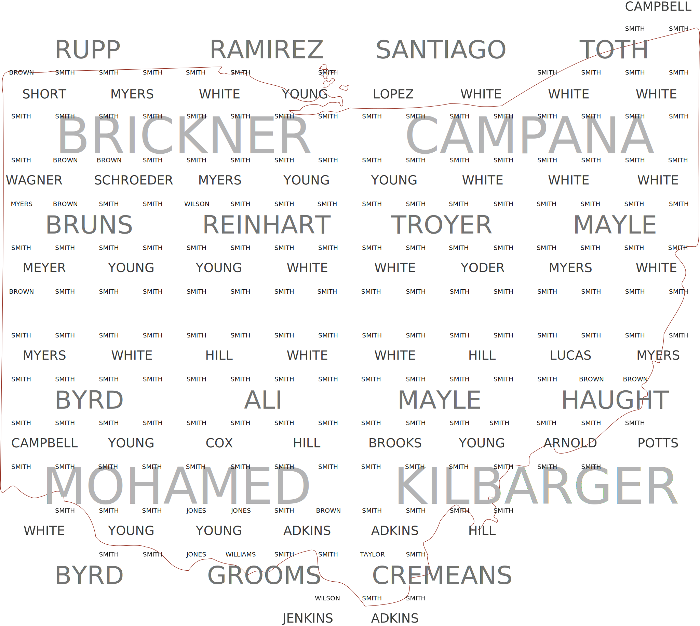

This code implements a custom spatial text data processing algorithm. It takes points with some text (in this case surnames) and divides them into a set of "spatial documents" with a quadtree.
Next, it treats the cells on the same level of the quadtree as a collection of documents and calculates TF-IDF (https://en.wikipedia.org/wiki/Tf%E2%80%93idf).
The result is the TF-IDF rating for each surname in each cell, which can be visualized on a map. The source surname data (ohio_shortest.zip) as well as an example of a text map (textmap.svg) are provided.

The size of the text on the map corresponds to a quadtree level.
